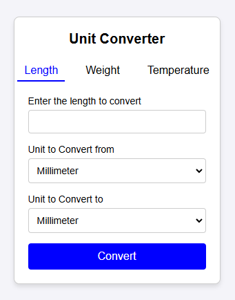
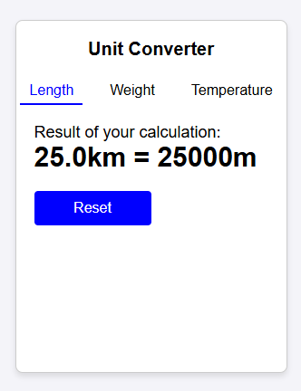

# Unit Converter

A simple web-based application built with **Java**, **JSP (JavaServer Pages)**, and **Servlets** to convert values between various units of measurement. The application provides a user-friendly interface for converting units of length, weight, temperature, and more.

## Features
- Convert between units of **Length**, **Weight**, and **Temperature**.
- Input a value to convert via a web form.
- Select units to convert **from** and **to**.
- View the converted value on the same page dynamically.

## Supported Units
### Length
- Millimeter (mm)
- Centimeter (cm)
- Meter (m)
- Kilometer (km)
- Inch (in)
- Foot (ft)
- Yard (yd)
- Mile (mi)

### Weight
- Milligram (mg)
- Gram (g)
- Kilogram (kg)
- Ounce (oz)
- Pound (lb)

### Temperature
- Celsius (°C)
- Fahrenheit (°F)
- Kelvin (K)

## Requirements
- **Java Development Kit (JDK)** 17 or higher.
- A **Servlet container** or application server like Apache Tomcat.
- A web browser for testing the application.
- IDE for Java (e.g., IntelliJ IDEA, Eclipse, or NetBeans) configured with a server runtime.

## Installation and Setup
1. Clone the repository to your local machine:
   ```bash
   git clone https://github.com/ErickBrayan/Unit-Converter.git
   cd unit-converter-web
2. Open the project in your preferred Java IDE.
3. Add an Apache Tomcat runtime to your IDE.
4. Deploy the project to the Tomcat server.
5. Build and deploy the application:
    ```bash
   mvn clean install
6. Start the server and navigate to the application in your web browser:
    ```bash
   http://localhost:8080/[Application-Context]

## Screenshots
Here are some screenshots of the application:





https://roadmap.sh/projects/unit-converter
